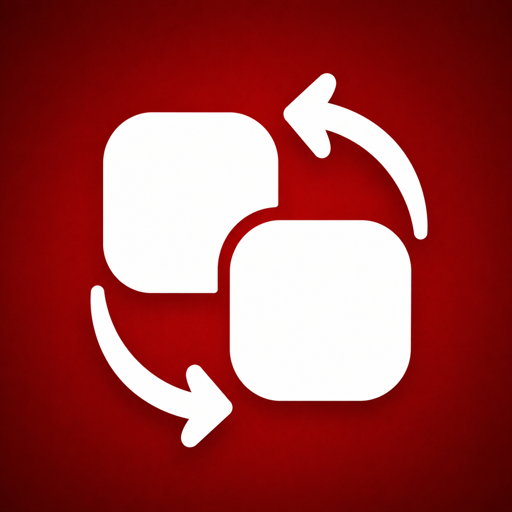

<p align="center">
  
</p>

<h1 align="center">MacICNS</h1>

<p align="center">Keep your Mac app icons unmistakably yours.</p>

<p align="center">
  <a href="https://github.com/guigx7/mac-icns/releases"></a>
  
  
  <a href="LICENSE"></a>
</p>

MacICNS is an open-source macOS menu-bar app that maps compatible applications to custom `.icns` files. It keeps enabled mappings in place after supported application updates and can reload the Dock after a manual refresh.

## Quick Start

### DMG — recommended

1. Download `MacICNS-vX.Y.Z-macos-arm64.dmg` from [Releases](https://github.com/guigx7/mac-icns/releases).
2. Open the disk image and drag **MacICNS.app** to **Applications**.
3. Open MacICNS from Applications or Spotlight.

### ZIP

1. Download `MacICNS-vX.Y.Z-macos-arm64.zip` from [Releases](https://github.com/guigx7/mac-icns/releases).
2. Unzip it, then move **MacICNS.app** to `/Applications`.

### Homebrew

```bash
brew install --cask guigx7/tap/macicns
```

Homebrew installs the same ZIP distribution into Applications.

## Requirements and Compatibility

- Apple Silicon Mac (M-series)
- macOS 14 Sonoma or later

MacICNS only lists applications whose icon can be changed safely on the current Mac. System-protected, App Store-managed, or otherwise non-writable applications may be unavailable in the app picker. This is a macOS limitation, not an additional permission that MacICNS can safely bypass.

## First Launch

Current releases are ad-hoc signed and **not notarized by Apple**. macOS may block the first launch of a downloaded copy. If that happens:

1. Try opening MacICNS once.
2. Open **System Settings → Privacy & Security**.
3. Scroll to Security and choose **Open Anyway** for MacICNS.
4. Confirm **Open**.

That approval is saved, so later launches work normally from Spotlight, Dock, Launchpad, or Applications. Homebrew does not bypass this macOS security check.

## How It Works

1. Choose a compatible app and a custom `.icns` file.
2. MacICNS applies the icon and stores the mapping locally.
3. Keep the mapping enabled to repair it after supported app updates.
4. Use **Refresh Icons** from the menu bar or main window to reapply mappings and reload Dock icon caches.

You can disable a mapping to restore the original app icon, replace its custom icon without remapping the application, or delete the mapping completely.

## Privacy

MacICNS stores mappings and diagnostics only on your Mac. It collects no telemetry, creates no online account, and sends no mapping data anywhere.

## Development

```bash
xcodebuild test -project MacICNS.xcodeproj -scheme MacICNS \
  -destination 'platform=macOS' \
  -derivedDataPath /private/tmp/macicns-tests \
  CODE_SIGNING_ALLOWED=NO
```

See [CONTRIBUTING.md](CONTRIBUTING.md) for local development and contribution guidance.

## Uninstall

1. Quit MacICNS from its menu-bar menu.
2. Delete `/Applications/MacICNS.app`.
3. Optionally delete `~/Library/Application Support/MacICNS/` to remove local mappings and diagnostics. This cannot be undone.

## Security

See [SECURITY.md](SECURITY.md) for vulnerability-reporting guidance. Do not post security-sensitive information in a public issue.

## License

MacICNS is open source under the [MIT License](LICENSE).
